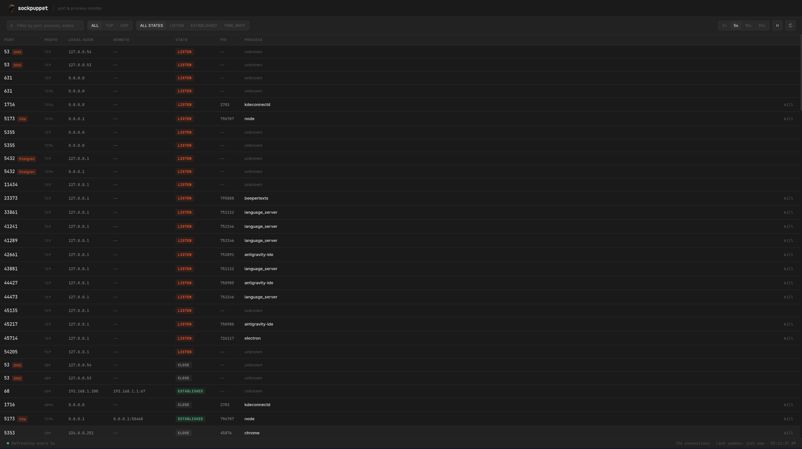

<p align="center">
  
</p>

# Sockpuppet


A lightweight port and process monitor for Linux. See what's listening on your ports, what processes are holding them, and kill anything you don't want from a clean desktop UI.



---

## Features

- **Live connection table** — TCP, TCP6, UDP, UDP6 connections at a glance
- **Process mapping** — maps each port to the process name and PID holding it
- **Service labels** — common ports auto-labeled (SSH, Postgres, Vite, Redis, etc.)
- **Color-coded states** — LISTEN, ESTABLISHED, TIME_WAIT each have distinct visual treatment
- **Kill button** — terminate any process you own directly from the UI, with a confirmation modal
- **Auto-refresh** — configurable intervals (2s / 5s / 10s / 30s) with pause support
- **Filter & search** — filter by port number, process name, address, state, or protocol
- **Status bar** — live refresh indicator, connection count, and last update time

---

## Requirements

- Linux (reads from `/proc/net/tcp`, `/proc/net/udp`)
- [Rust](https://rustup.rs/) + Cargo
- [Node.js](https://nodejs.org/) 18+
- [Tauri v2 prerequisites](https://v2.tauri.app/start/prerequisites/)

---

## Getting Started

### 1. Clone the repo

```bash
git clone https://github.com/yourname/sockpuppet.git
cd sockpuppet
```

### 2. Install frontend dependencies

```bash
npm install
```

### 3. Run in development mode

```bash
npm run tauri dev
```

The app window will open. The Rust backend compiles on first run — give it a minute.

### 4. Build for release

```bash
npm run tauri build
```

The compiled binary and AppImage will be output to `src-tauri/target/release/bundle/`.

---

## Project Structure

```
sockpuppet/
├── src/                        # React frontend
│   ├── App.jsx                 # Root component, state & polling logic
│   ├── index.css               # Design tokens & global styles
│   └── components/
│       ├── ConnectionTable.jsx # Main data table
│       ├── Toolbar.jsx         # Search, filters, refresh controls
│       ├── KillModal.jsx       # Confirm-before-kill dialog
│       └── StatusBar.jsx       # Bottom status bar
├── src-tauri/
│   ├── src/
│   │   ├── lib.rs              # Tauri commands: get_connections, kill_process
│   │   └── main.rs             # Entry point
│   ├── Cargo.toml
│   ├── tauri.conf.json
│   └── capabilities/
│       └── default.json
├── index.html
├── package.json
└── vite.config.js
```

---

## How It Works

### Backend (Rust)

Sockpuppet reads network state directly from the Linux `/proc` filesystem — no external binaries, no `netstat`, no `ss`.

**Connection data** comes from:
- `/proc/net/tcp` and `/proc/net/tcp6` — TCP connections
- `/proc/net/udp` and `/proc/net/udp6` — UDP bindings

Each entry includes the local address/port, remote address/port, connection state, and a socket inode number.

**Process mapping** works by walking `/proc/{pid}/fd/` for every running process and resolving symlinks of the form `socket:[inode]`. This builds an inode → PID map, which is then joined against the network tables to identify which process owns each connection.

**Three Tauri commands** are exposed to the frontend:

| Command | Description |
|---|---|
| `get_connections()` | Returns all current connections with process info |
| `get_process_info(pid)` | Returns CPU%, memory, and status for a given PID |
| `kill_process(pid)` | Sends SIGKILL to the target process |

### Frontend (React)

The frontend polls `get_connections` on a configurable interval and renders the results into a filterable table. All state lives in `App.jsx`. Components are presentational.

---

## Usage Notes

### Killing processes

Sockpuppet can only kill processes owned by the user it's running as. Attempting to kill a system process or one owned by another user will return a permission error.

If you need to kill privileged processes, run Sockpuppet with `sudo` — but be careful.

### Why can't I see the process name for some connections?

Some kernel-level or very short-lived connections may not have a readable `/proc` entry by the time Sockpuppet scans. These show up as `unknown` in the process column. This is normal.

### UDP connections

UDP is connectionless, so UDP entries represent bound sockets, not active sessions. The state column will typically show `—` for UDP entries.

---

## Keyboard Shortcuts

| Key | Action |
|---|---|
| `Esc` | Close kill confirmation modal |
| `Enter` | Confirm kill (when modal is open) |

---

## Customization

### Refresh interval defaults

Edit the `REFRESH_INTERVALS` array in `App.jsx`:

```js
const REFRESH_INTERVALS = [2000, 5000, 10000, 30000]; // ms
const DEFAULT_INTERVAL = 5000;
```

### Known port labels

Add or edit entries in the `KNOWN_PORTS` map in `App.jsx`:

```js
const KNOWN_PORTS = {
  22: "SSH",
  5432: "Postgres",
  6379: "Redis",
  // add your own...
};
```

### Colors & theme

All design tokens live in `src/index.css` as CSS variables:

```css
:root {
  --accent:         #E8512A;  /* orange-red — change this to retheme */
  --bg-base:        #1A1A1A;
  --bg-surface:     #222222;
  /* ... */
}
```

---

## Troubleshooting

**The app builds but shows no connections**

Make sure you're running on Linux. Sockpuppet reads from `/proc/net/` which is Linux-only. Check that `/proc/net/tcp` exists and is readable by your user.

**Kill fails with a permission error**

You can only kill processes you own. For system processes, run `sudo npm run tauri dev` or `sudo ./sockpuppet` — but use with caution.

**Rust compilation fails on first run**

Make sure all [Tauri v2 prerequisites](https://v2.tauri.app/start/prerequisites/) are installed, including `libwebkit2gtk`, `libgtk-3-dev`, and other system libs. On Ubuntu/Debian:

```bash
sudo apt update
sudo apt install libwebkit2gtk-4.1-dev libgtk-3-dev libayatana-appindicator3-dev librsvg2-dev
```

**Process names show as `unknown` for most connections**

Sockpuppet needs read access to `/proc/{pid}/fd/`. If you're running in a restricted environment or container, this may not be available. Run as your normal desktop user.

---

## Tech Stack

| Layer | Technology |
|---|---|
| Desktop shell | [Tauri v2](https://v2.tauri.app/) |
| Backend | Rust — `sysinfo`, `serde` |
| Frontend | React 18, Vite |
| Styling | Plain CSS with custom properties |
| Fonts | Inter, JetBrains Mono |

---

## License

Apache 2.0
